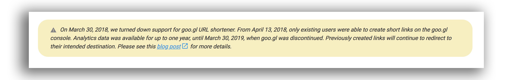

* Log in with your Gmail account on [Google Drive](https://drive.google.com/)
* Choose the folder or document to share
* Right button of mouse, choose `Share` feature
* A dialog box will appear. Click over the `Advanced` option (on the lower right bottom)
* Click on `Change`
* Click on `Enabled: any user with the link`
* Click on `Access: Any user (does not require access):` choose `Can see` option
* Clic on `Save`
* ~~Go to [Google Shortener](https://goo.gl/)~~

* ~~Paste the URL link that generate [Google Drive](https://drive.google.com/)~~
* ~~Automatically [Google Shortener](https://goo.gl/) will offer a `QR` code.~~
* Right button mouse, choose `Get link to share` option. 
* Copy the URL link (`Ctrl` + `C`) that will create (usually in this way: [https://drive.google.com/open?id=0BzEQFvceWPQvb1NVRFVvUnZiam8](https://drive.google.com/open?id=0BzEQFvceWPQvb1NVRFVvUnZiam8))
* Go to this website: [http://atomurl.net/qrcode/](http://atomurl.net/qrcode/)
* Paste the former URL copied in the `URL` option (other ones to choose: `Text`, `Phone Number`, `SMS`, `Contact`, `Google Drive`)
* Those default options offered are right for general purposes: `200px` and `Local QR Code Generator` 
* Click on `Make QR Code`
* Then click on `Download this image`