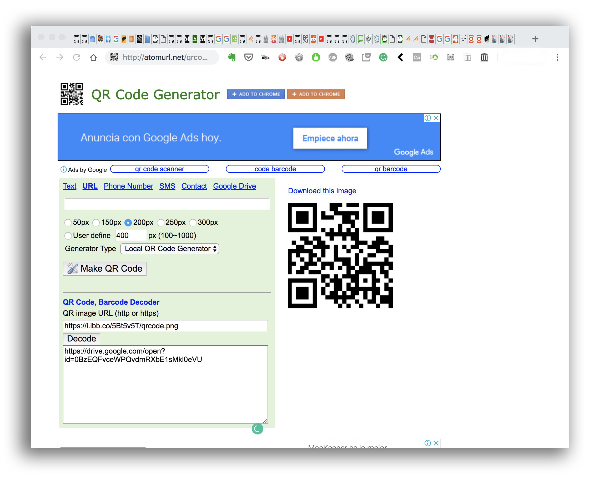
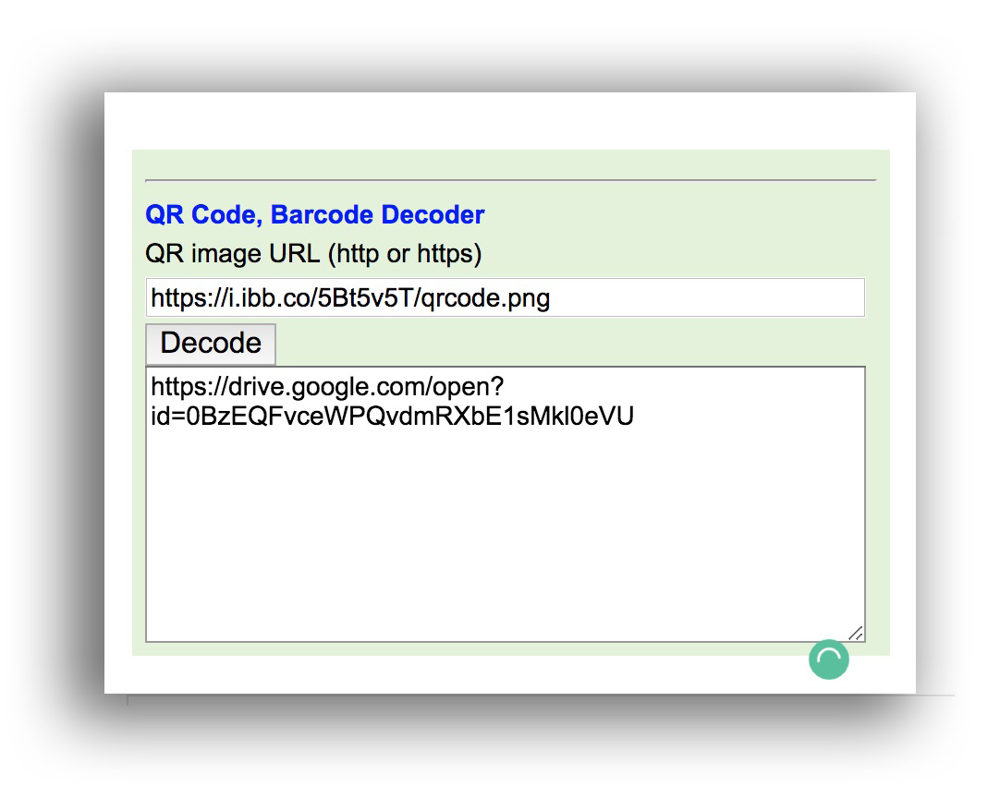

# RATIONALE #

* Checklist to generate QR codes for any digital asset
* This repo is a living document that will grow and adapt over time

### What is this repository for? ###

* Quick summary
    - Procedures to generate QR codes for academic papers in symposia, academic events, _etc_.

### How do I get set up? ###

* Configuration
    - Check [`procedure.md`](Procedure.md)
* Dependencies
    - Check [`colophon.md`](Colophon.md)
* Database configuration
    - Out of the scope of this repo
* How to run tests
    - The same QR code generator encode/decode the image generated.
    

### Who do I talk to? ###

* Repo owner or admin
    - Contact `imhicihu` at `gmail` dot `com`

### Code of Conduct

* Please, check our [Code of Conduct](code_of_conduct.md)

### Legal ###

* All trademarks are the property of their respective owners.

### License ###

* The content of this project itself is licensed under the 
